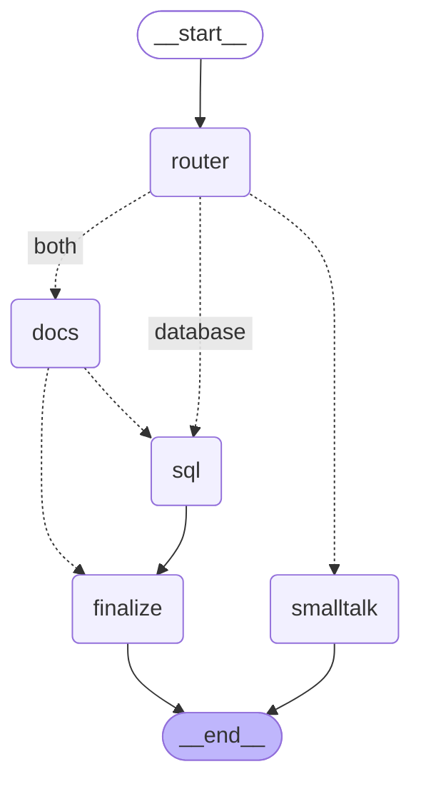

# Architecture

This diagram is **auto-generated** from the LangGraph app in `src/assistant.py`.
Whenever you change the graph, regenerate it with:

```bash
python src/gen_diagram.py
```


```mermaid
graph TD;
	__start__([<p>__start__</p>]):::first
	router(router)
	smalltalk(smalltalk)
	docs(docs)
	sql(sql)
	finalize(finalize)
	__end__([<p>__end__</p>]):::last
	__start__ --> router;
	docs -.-> finalize;
	docs -.-> sql;
	router -. &nbsp;both&nbsp; .-> docs;
	router -.-> smalltalk;
	router -. &nbsp;database&nbsp; .-> sql;
	sql --> finalize;
	finalize --> __end__;
	smalltalk --> __end__;
	classDef default fill:#f2f0ff,line-height:1.2
	classDef first fill-opacity:0
	classDef last fill:#bfb6fc
```
